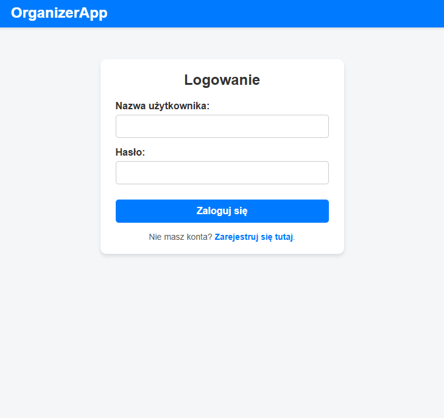
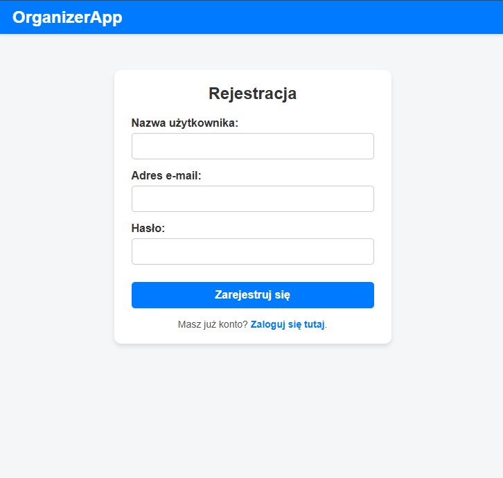
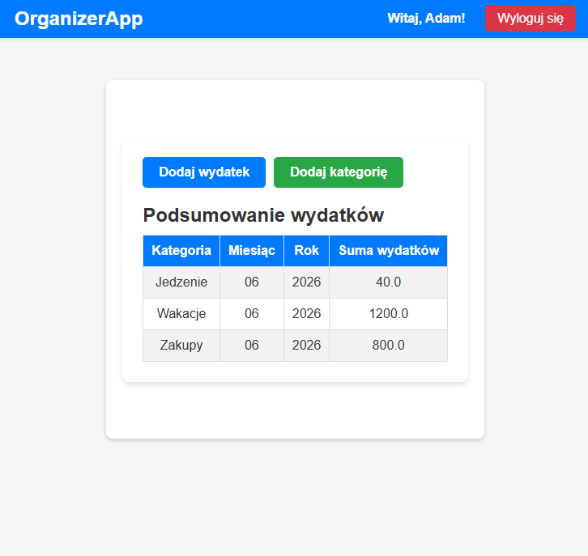
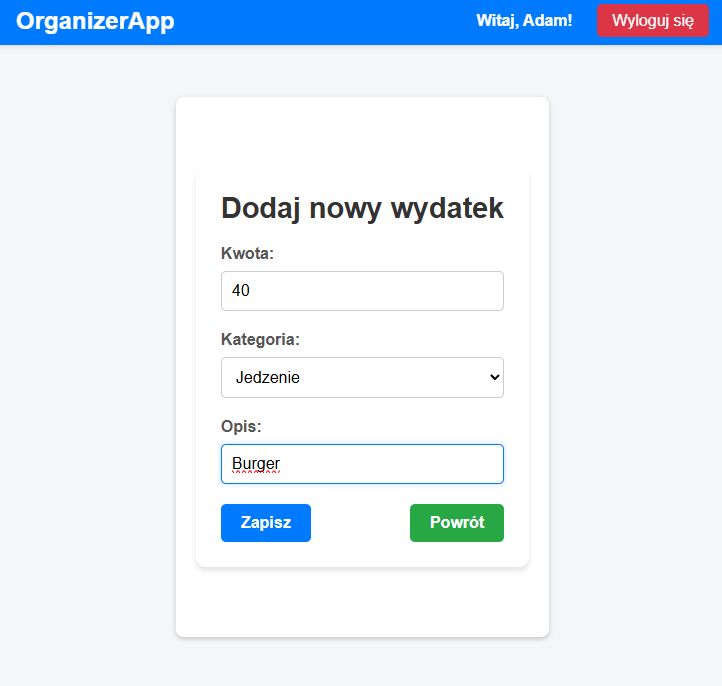
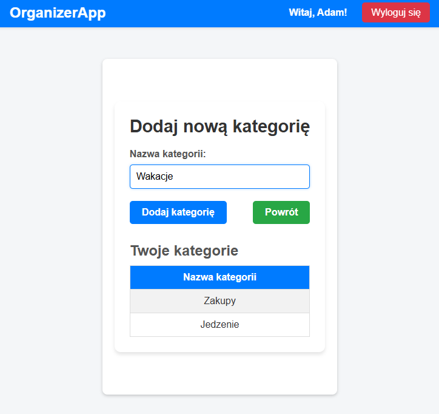

# OrganizerApp — Personal Expense Tracker

A Flask web application for tracking personal expenses, organized by categories with monthly and yearly summaries.

## Screenshots

### Login


### Register


### Dashboard


### Add Expense


### Manage Categories


## Tech Stack

| Layer | Technology |
|---|---|
| Backend | Python 3.13, Flask 3.1 |
| Database | SQLite (via SQLAlchemy 2.0) |
| Migrations | Flask-Migrate / Alembic |
| Authentication | Flask-Login |
| Forms | Flask-WTF / WTForms |
| Frontend | Jinja2, CSS |

## Features

- User registration and login
- Custom expense categories per user
- Add expenses with amount, description and category
- Dashboard with expense summary grouped by category, month and year

## Project Structure

```
ArchitekturaPython/
├── app/
│   ├── __init__.py          # Flask app config, database, login manager
│   ├── models/
│   │   ├── user.py          # User model
│   │   ├── category.py      # Category model
│   │   └── expense.py       # Expense model
│   ├── routes/
│   │   ├── routes.py        # Login, register, logout
│   │   └── expenses.py      # Expenses, categories, dashboard
│   ├── templates/           # Jinja2 HTML templates
│   └── static/              # CSS files
├── migrations/              # Alembic migrations (auto-generated)
├── run.py                   # Application entry point
├── requirements.txt
└── Dockerfile
```

## Running Locally

### Prerequisites

- Python 3.10+
- pip

### Steps

```bash
# 1. Clone the repository
git clone <repository-url>
cd ArchitekturaPython

# 2. Create and activate a virtual environment
python -m venv venv

# Windows
.\venv\Scripts\Activate.ps1

# Linux / macOS
source venv/bin/activate

# 3. Install dependencies
pip install -r requirements.txt

# 4. Set up the database
flask db init
flask db migrate -m "initial"
flask db upgrade

# 5. Start the application
python run.py
```

App available at: **http://127.0.0.1:5000**

## Running with Docker

```bash
# Build the image
docker build -t organizerapp .

# Run the container
docker run -p 5000:5000 -v organizerapp_data:/app/app organizerapp
```

App available at: **http://localhost:5000**

> The `-v` flag mounts a volume so the SQLite database persists across container restarts.

## Database

The app uses **SQLite** — the `architektura.db` file is created automatically in the `app/` folder when migrations are run. No external database server required.
